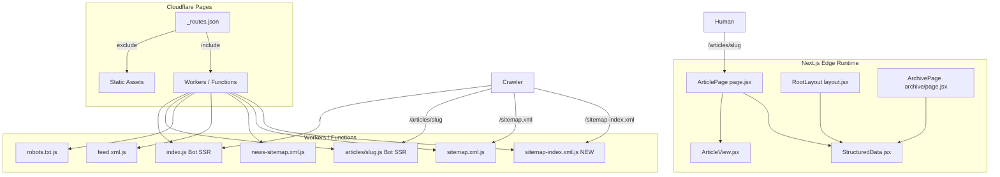

# Design Document: SEO Infrastructure

## Overview

OpenTuwa runs on Cloudflare Pages with Next.js (edge runtime). Articles live in a Cloudflare D1 database. The platform already has a meaningful SEO foundation — per-page Open Graph/Twitter Card metadata, JSON-LD structured data components, a dynamic sitemap, a news sitemap, an RSS feed, a robots.txt, and a bot-detection SSR layer.

This design addresses the gaps identified in the requirements across seven areas: crawlability, metadata quality, structured data, internal discoverability, social preview compatibility, content discovery, and technical SEO signals. The guiding principle is **conservative improvement**: patch existing files rather than replace them, maintain Cloudflare Pages/Workers runtime compatibility (no Node.js APIs), and eliminate duplicate SEO components.

### Key Design Decisions

1. **No new components** — all fixes go into existing files (`StructuredData.jsx`, `functions/articles/[slug].js`, `functions/index.js`, `src/app/articles/[slug]/page.jsx`, `src/app/layout.jsx`, etc.).
2. **Deduplication via root layout** — `OrganizationSchema` and `WebSiteSchema` are already emitted in `src/app/layout.jsx`; page-level duplicates in `page.jsx` and `archive/page.jsx` will be removed.
3. **Dynamic sitemap-index** — a new `functions/sitemap-index.xml.js` replaces the stale static `public/sitemap-index.xml`, and `_routes.json` is updated to route `/sitemap-index.xml` through the Worker.
4. **Bot SSR enrichment** — `functions/articles/[slug].js` and `functions/index.js` receive targeted additions (OG/Twitter meta, JSON-LD, related articles, canonical) without restructuring the existing logic.

---

## Architecture

---

## Components and Interfaces

### 1. `functions/sitemap-index.xml.js` (new file)

Replaces the stale `public/sitemap-index.xml`. Returns a sitemap index with a live `<lastmod>` timestamp.

**Interface:** `GET /sitemap-index.xml` → `application/xml`

### 2. `public/_routes.json` (patch)

Add `/sitemap-index.xml` to the `include` array so the new Worker function is invoked instead of the static file.

### 3. `functions/robots.txt.js` (patch)

Add `Allow: /feed.xml` directive and ensure `/archive` and `/about` are not disallowed.

### 4. `functions/articles/[slug].js` (patch)

Enrich the bot-rendered `<head>` with:
- Full OG meta tags (`og:title`, `og:description`, `og:image`, `og:image:width/height`, `og:type`, `og:url`)
- Twitter Card meta tags (`twitter:card`, `twitter:title`, `twitter:description`, `twitter:image`, `twitter:creator`)
- `<link rel="canonical">`
- JSON-LD `NewsArticle` block
- Related articles section (3 articles from D1, ordered by recency, excluding current slug)
- Fetch `author_name`, `tags`, `updated_at` in the DB query

### 5. `functions/index.js` (patch)

Enrich the bot-rendered `<head>` with:
- OG meta tags for homepage/author/tag pages
- Twitter Card meta tags
- Canonical link

### 6. `src/app/articles/[slug]/page.jsx` (patch)

- Add `og:image:width`, `og:image:height` to `generateMetadata`
- Add `article:published_time`, `article:tag` OG properties
- Add `<meta name="author">` via `authors` metadata field
- Add `robots: max-image-preview:large, max-snippet:-1`
- Add `twitter:creator` with `@` prefix

### 7. `src/components/StructuredData.jsx` (patch)

- Add `mainEntityOfPage` to `NewsArticleSchema`
- Add `keywords` field (comma-separated tags)
- Guard `dateModified` so it is never earlier than `datePublished`
- Ensure `image` field uses absolute URL

### 8. `src/app/articles/[slug]/page.jsx` — duplicate schema removal

Remove `<OrganizationSchema />` and `<WebSiteSchema />` from the article page render since they are already emitted by the root layout.

### 9. `src/app/(site)/archive/page.jsx` — duplicate schema removal

Remove `<OrganizationSchema />` and `<WebSiteSchema />` from the archive page render.

### 10. `src/app/(site)/page.jsx` — duplicate schema removal

Remove `<OrganizationSchema />` and `<WebSiteSchema />` from the homepage render.

### 11. `src/app/layout.jsx` (patch)

- Confirm `alternates.types['application/rss+xml']` is declared (already present — verify and keep).
- Confirm `OrganizationSchema` and `WebSiteSchema` are emitted exactly once in `<head>` (already present — keep).

---

## Data Models

No database schema changes. The existing `articles` table columns used:

| Column | Used by |
|---|---|
| `slug` | All sitemap, bot SSR, article page |
| `title` | All |
| `seo_description` | Article page meta, bot SSR |
| `subtitle` | Description fallback |
| `excerpt` | Description fallback |
| `image_url` | OG image, sitemap image, JSON-LD |
| `author` | Meta author, twitter:creator, JSON-LD |
| `author_name` | Bot SSR display, feed |
| `published_at` | lastmod, datePublished, pubDate |
| `updated_at` | dateModified (guarded) |
| `tags` | article:tag, keywords, feed categories |
| `content_html` | Bot SSR body |
| `section` / `category` | Feed categories |

---

## Correctness Properties

*A property is a characteristic or behavior that should hold true across all valid executions of a system — essentially, a formal statement about what the system should do. Properties serve as the bridge between human-readable specifications and machine-verifiable correctness guarantees.*

### Property 1: Sitemap contains all articles

*For any* set of articles in D1, every article's slug must appear as a `<loc>` entry in the `/sitemap.xml` response, and no extra entries beyond the known static pages and articles should be present.

**Validates: Requirements 1.1**

### Property 2: Sitemap lastmod is valid ISO 8601

*For any* article with a non-null `published_at` value, the corresponding `<lastmod>` element in the sitemap must be a valid ISO 8601 date string.

**Validates: Requirements 1.2**

### Property 3: Sitemap-index lastmod is current

*For any* request to `/sitemap-index.xml`, the `<lastmod>` values in the response must be within 24 hours of the current time (i.e., dynamically generated, not stale).

**Validates: Requirements 1.5, 1.6**

### Property 4: Bot SSR article head completeness

*For any* article slug, when the bot SSR layer serves the article page, the response HTML must contain `og:title`, `og:description`, `og:image`, `og:type`, `og:url`, `twitter:card`, `twitter:title`, `twitter:description`, `twitter:image`, a canonical link, and a JSON-LD script block.

**Validates: Requirements 4.1, 4.2, 4.3, 4.4**

### Property 5: NewsArticle JSON-LD field completeness

*For any* article rendered by the Next.js article page, the emitted JSON-LD block must contain `headline`, `description`, `datePublished`, `dateModified`, `author`, `publisher`, `mainEntityOfPage`, and (when tags are present) `keywords`.

**Validates: Requirements 5.1, 5.2, 5.4, 5.6**

### Property 6: dateModified is never earlier than datePublished

*For any* article where both `datePublished` and `dateModified` are present in the JSON-LD, `dateModified >= datePublished` must hold.

**Validates: Requirements 5.7**

### Property 7: No duplicate Organization/WebSite JSON-LD per page

*For any* rendered page, the count of JSON-LD script blocks with `@type: "NewsMediaOrganization"` must be exactly 1, and the count with `@type: "WebSite"` must be exactly 1.

**Validates: Requirements 6.1, 6.2**

### Property 8: Related articles links present in bot SSR

*For any* article slug served by the bot SSR layer, the response HTML must contain at least 3 `<a>` elements whose `href` attributes match the pattern `/articles/{slug}` and are different from the current article's URL.

**Validates: Requirements 7.2, 7.3**

### Property 9: Archive links are crawlable

*For any* article in D1, the archive page HTML (both Next.js and bot SSR) must contain an `<a href="/articles/{slug}">` element with the article title as visible text.

**Validates: Requirements 8.1, 8.2, 8.3**

### Property 10: OG image dimensions declared

*For any* article page response (Next.js rendered), when `image_url` is present, the metadata must include `og:image:width` and `og:image:height` properties.

**Validates: Requirements 9.1, 9.3**

### Property 11: twitter:creator has @ prefix

*For any* article with a non-empty `author` field, the `twitter:creator` metadata value must start with `@`.

**Validates: Requirements 10.1**

### Property 12: Feed entry field completeness

*For any* article in the RSS feed, each `<item>` must contain `<title>`, `<link>`, `<guid isPermaLink="true">`, `<pubDate>`, `<description>`, and `<dc:creator>`.

**Validates: Requirements 11.1**

### Property 13: Canonical URL format

*For any* page, the canonical URL must use `https://`, the `opentuwa.com` domain, and no trailing slash (except the bare homepage).

**Validates: Requirements 13.6**

---

## Error Handling

| Scenario | Handling |
|---|---|
| D1 query fails in sitemap-index function | Return minimal valid XML with static sitemap references |
| Article not found in bot SSR | Fall through to `context.next()` (existing behaviour, preserved) |
| `updated_at` is null in JSON-LD | Fall back to `published_at` for `dateModified` |
| `updated_at` < `published_at` | Use `published_at` as `dateModified` |
| `image_url` is a relative path | Prepend `origin` to make it absolute (already done in sitemap; apply same pattern in bot SSR and JSON-LD) |
| Tags field is JSON string vs comma string | Parse defensively with try/catch then comma-split fallback (pattern already used in feed.xml.js) |
| Related articles query returns < 3 results | Render however many are available; do not error |

---

## Testing Strategy

### Unit Tests

Focus on specific examples and edge cases:

- `dateModified` guard: article with `updated_at` earlier than `published_at` → `dateModified` equals `published_at`
- `dateModified` guard: article with null `updated_at` → `dateModified` equals `published_at`
- `twitter:creator` formatting: author `"john"` → `"@john"`; no author → `"@opentuwa"`
- Canonical URL: slug `"my-article"` → `"https://opentuwa.com/articles/my-article"` (no trailing slash)
- Tags parsing: JSON string `'["a","b"]'` and comma string `"a, b"` both produce `["a", "b"]`
- Relative `image_url` (`/img/foo.jpg`) is resolved to absolute URL in bot SSR and JSON-LD

### Property-Based Tests

Use **fast-check** (TypeScript/JavaScript PBT library) with a minimum of 100 iterations per property.

Each test is tagged with: `// Feature: seo-infrastructure, Property N: <property_text>`

| Property | Test approach |
|---|---|
| P1: Sitemap completeness | Generate random article arrays, call sitemap builder, assert every slug appears in output |
| P2: Sitemap lastmod ISO 8601 | Generate random `published_at` timestamps, assert output matches ISO 8601 regex |
| P3: Sitemap-index lastmod current | Call function, parse `<lastmod>`, assert within 24 h of `Date.now()` |
| P4: Bot SSR head completeness | Generate random article objects, call bot SSR renderer, assert all required meta tags present |
| P5: JSON-LD field completeness | Generate random article objects, call `NewsArticleSchema` renderer, parse JSON-LD, assert required fields |
| P6: dateModified ≥ datePublished | Generate pairs where `updated_at` may be before/after/null, assert invariant holds |
| P7: No duplicate JSON-LD | Render full page, count JSON-LD blocks by `@type`, assert counts are 1 |
| P8: Related articles links | Generate article + related list, call bot SSR renderer, count `/articles/` hrefs ≥ 3 |
| P9: Archive crawlable links | Generate article list, render archive HTML, assert each slug has an `<a>` element |
| P10: OG image dimensions | Generate articles with `image_url`, assert `og:image:width` and `og:image:height` present |
| P11: twitter:creator @ prefix | Generate random author strings, assert output starts with `@` |
| P12: Feed entry completeness | Generate random articles, call feed builder, parse XML, assert required elements per item |
| P13: Canonical URL format | Generate random slugs/pages, assert canonical matches `https://opentuwa.com/...` pattern |

**PBT library:** `fast-check` (already compatible with Cloudflare Workers/edge runtime; no Node.js APIs required).

**Configuration:** Each `fc.assert(fc.property(...))` call uses `{ numRuns: 100 }` minimum.
