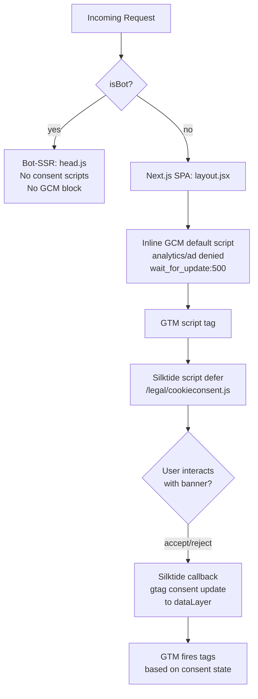

# Design Document: Silktide Consent Manager

## Overview

This design replaces the existing Cookiebot integration with a self-hosted Silktide Consent Manager. The Cookiebot CDN endpoint is compromised (hijacked S3 bucket serving malware), making removal urgent. The replacement self-hosts Silktide JS/CSS under `/legal/`, sets Google Consent Mode v2 (GCM v2) defaults before GTM loads, and wires Silktide's accept/reject callbacks to push GCM updates to `window.dataLayer`.

The site has two rendering paths that both need updating:
- **Next.js SPA path** (`src/app/layout.jsx`) — serves real users via Cloudflare Pages
- **Bot-SSR path** (`functions/_utils/head.js`) — serves search engine crawlers via Cloudflare Workers

Consent scripts must be injected in the SPA path and omitted entirely from the bot-SSR path.

---

## Architecture



**Script loading order in `<head>` (non-bot):**
1. Inline `<script>` — initialises `window.dataLayer` and pushes GCM v2 defaults (denied)
2. GTM `<script>` tag — loads GTM container
3. `<link rel="stylesheet">` — Silktide CSS (`/legal/cookieconsent.css`)
4. `<script defer>` — Silktide JS (`/legal/cookieconsent.js`)

This ordering guarantees GCM defaults are set before any GTM tag fires, and Silktide loads non-blocking after the critical path.

---

## Components and Interfaces

### 1. GCM Default Inline Script

A small inline `<script>` block placed at the top of `<head>`, before GTM. It initialises `window.dataLayer` and pushes the consent defaults.

```js
window.dataLayer = window.dataLayer || [];
function gtag(){dataLayer.push(arguments);}
gtag('consent', 'default', {
  analytics_storage: 'denied',
  ad_storage: 'denied',
  ad_user_data: 'denied',
  ad_personalization: 'denied',
  wait_for_update: 500,
});
```

**Placement:**
- Next.js: `<Script id="gcm-default" strategy="beforeInteractive">` in `layout.jsx`
- Bot-SSR: omitted entirely (bots don't need consent signalling)

### 2. Silktide Script + CSS Tags

Self-hosted assets served from `/legal/`:

```html
<link rel="stylesheet" href="/legal/cookieconsent.css">
<script src="/legal/cookieconsent.js" defer></script>
```

**Placement:**
- Next.js: `<link>` in `<head>`, `<Script src="/legal/cookieconsent.js" strategy="afterInteractive">` in `layout.jsx`
- Bot-SSR: omitted entirely

### 3. Silktide Configuration Object

A `window.CookieConsent` config object (or equivalent Silktide init call) placed in an inline script after the Silktide script loads. This configures categories and GCM callbacks:

```js
// Pseudocode — exact API matches Silktide's documented init interface
CookieConsent.run({
  categories: {
    necessary: { enabled: true, readOnly: true },
    analytics: { enabled: false },
    marketing: { enabled: false },
  },
  onConsent: ({ cookie }) => {
    gtag('consent', 'update', {
      analytics_storage: cookie.categories.includes('analytics') ? 'granted' : 'denied',
      ad_storage: cookie.categories.includes('marketing') ? 'granted' : 'denied',
      ad_user_data: cookie.categories.includes('marketing') ? 'granted' : 'denied',
      ad_personalization: cookie.categories.includes('marketing') ? 'granted' : 'denied',
    });
  },
  onChange: ({ cookie }) => {
    // same mapping as onConsent
  },
});
```

### 4. `functions/_utils/head.js` — Bot-SSR Head Builder

Remove the `COOKIEBOT_ID` constant and the `<script id="Cookiebot">` tag from `buildHead()`. No consent scripts are added for bots. The function signature and all other output remain unchanged.

### 5. `public/legal/` — Self-Hosted Assets

| File | Source |
|------|--------|
| `public/legal/cookieconsent.js` | Silktide-provided JS (user-supplied) |
| `public/legal/cookieconsent.css` | Silktide-provided CSS (user-supplied) |

These are static files committed to the repo. No build step required.

### 6. `public/_headers` — CSP + Cache Rules

Two changes:
1. Add `/legal/*` cache rule: `Cache-Control: public, max-age=31536000, immutable`
2. Update the global `/*` CSP: remove Cookiebot domains, keep `'self'` for script-src (covers `/legal/cookieconsent.js`)

### 7. `functions/robots.txt.js` — Silktide Crawler

Add a `User-agent: Silktide` block with `Allow: /` so the Silktide cookie auditor can scan the site.

---

## Data Models

### Consent State (runtime, in-memory)

The consent state lives in `window.dataLayer` as a sequence of push events. No custom data model is needed — GCM v2 uses the standard `gtag('consent', ...)` API.

```
dataLayer = [
  { 'gtm.start': <timestamp>, event: 'gtm.js' },   // GTM init
  { 0: 'consent', 1: 'default', 2: { analytics_storage: 'denied', ... } },  // GCM default
  { 0: 'consent', 1: 'update', 2: { analytics_storage: 'granted', ... } },  // after user accepts
]
```

### Consent Cookie (persisted)

Silktide stores consent in a first-party cookie (typically `cc_cookie` or similar). The cookie contains a JSON payload with accepted categories. On revisit, Silktide reads this cookie and skips the banner if a valid consent record exists.

```json
{
  "categories": ["necessary", "analytics"],
  "revision": 0,
  "data": null,
  "consentTimestamp": "2025-01-01T00:00:00.000Z",
  "lastConsentTimestamp": "2025-01-01T00:00:00.000Z"
}
```

---

## Correctness Properties

*A property is a characteristic or behavior that should hold true across all valid executions of a system — essentially, a formal statement about what the system should do. Properties serve as the bridge between human-readable specifications and machine-verifiable correctness guarantees.*

### Property 1: Bot-SSR head contains no consent scripts

*For any* call to `buildHead()` where the rendering context is a bot request, the returned HTML string should contain no reference to `cookiebot.com`, no Silktide script or CSS tags, and no GCM inline script block.

**Validates: Requirements 1.1, 7.1, 7.2, 8.7**

### Property 2: Non-bot head contains no Cookiebot references

*For any* call to `buildHead()` in a non-bot context, the returned HTML string should contain no reference to `cookiebot.com` or `consentcdn.cookiebot.com`.

**Validates: Requirements 1.1, 1.3**

### Property 3: GCM default script sets all required denied defaults

*For any* rendering of the GCM default inline script, the script content should contain `analytics_storage: 'denied'`, `ad_storage: 'denied'`, `ad_user_data: 'denied'`, `ad_personalization: 'denied'`, and `wait_for_update: 500`.

**Validates: Requirements 3.2, 3.3, 3.4, 3.5, 3.6**

### Property 4: GCM default script precedes GTM script in head

*For any* rendered non-bot `<head>` block, the character position of the GCM default inline script should be less than the character position of the GTM `<script>` tag, ensuring defaults are set before GTM fires.

**Validates: Requirements 3.1**

### Property 5: Silktide script carries defer attribute

*For any* non-bot rendered `<head>` block, the `<script>` tag referencing `/legal/cookieconsent.js` should carry the `defer` attribute.

**Validates: Requirements 2.4, 8.2**

### Property 6: Consent state round-trip

*For any* consent cookie value representing a prior user choice, initialising the Silktide library with that cookie present should result in the GCM update being pushed with the stored consent values, without displaying the banner.

**Validates: Requirements 4.5**

### Property 7: CSP excludes Cookiebot and includes required sources

*For any* reading of the `Content-Security-Policy` header value in `public/_headers`, the header should not contain `cookiebot.com` in any directive, should contain `'self'` in `script-src`, and should contain `https://www.googletagmanager.com` in `script-src`.

**Validates: Requirements 6.1, 6.2, 6.3, 6.4**

---

## Error Handling

### Silktide script fails to load

If `/legal/cookieconsent.js` fails to load (network error, 404), the page continues to function normally. No consent banner is shown. GCM defaults remain `denied` (set by the inline script before Silktide loads), so no analytics or marketing tags fire. This is the safe fallback.

### GCM `gtag` not defined

The inline GCM script defines a local `gtag` function that pushes to `window.dataLayer`. This is self-contained and does not depend on GTM being loaded first. If GTM fails to load, the `dataLayer` array still exists with the correct consent state for any future GTM load.

### Consent cookie corrupted or missing

Silktide handles this internally — if the consent cookie is absent or malformed, the banner is shown again. No custom error handling needed.

### Bot misclassification

If a real user is misclassified as a bot by `isBot()`, they receive a page without the consent banner. GCM defaults remain `denied`. This is acceptable — the user can still use the site, and no analytics fire without consent. The `isBot()` regex is conservative and unlikely to misclassify real browsers.

---

## Testing Strategy

### Unit Tests

Focus on the two code paths that are directly modified:

1. **`buildHead()` output** — verify Cookiebot script tag is absent, verify no consent scripts appear when `isBot` context is simulated
2. **GCM default script content** — verify all five required fields are present with correct values
3. **CSP string in `_headers`** — verify Cookiebot domains are absent, GTM domain is present, `'self'` is in script-src
4. **`robots.txt` output** — verify `Silktide` user-agent block is present with `Allow: /`

### Property-Based Tests

Use a property-based testing library (e.g. `fast-check` for JavaScript) with minimum 100 iterations per property.

Each test is tagged with: `Feature: silktide-consent-manager, Property N: <property_text>`

**Property 1 test** — Generate random `buildHead()` option objects, call `buildHead()` in bot context, assert output contains no `cookiebot`, no `/legal/cookieconsent`, no `gtag('consent'`.
`// Feature: silktide-consent-manager, Property 1: Bot-SSR head contains no consent scripts`

**Property 2 test** — Generate random `buildHead()` option objects, call `buildHead()` in non-bot context, assert output contains no `cookiebot.com`.
`// Feature: silktide-consent-manager, Property 2: Non-bot head contains no Cookiebot references`

**Property 3 test** — Generate the GCM default script string with any valid config, assert all five required fields are present.
`// Feature: silktide-consent-manager, Property 3: GCM default script sets all required denied defaults`

**Property 4 test** — Generate random head option objects, render the full non-bot head, assert `indexOf(gcmScript) < indexOf(gtmScript)`.
`// Feature: silktide-consent-manager, Property 4: GCM default script precedes GTM script in head`

**Property 5 test** — Generate random head option objects, render non-bot head, assert the Silktide script tag contains `defer`.
`// Feature: silktide-consent-manager, Property 5: Silktide script carries defer attribute`

**Property 6 test** — Generate random consent cookie payloads with valid category arrays, simulate Silktide init with cookie present, assert GCM update is pushed with matching consent values and banner is not shown.
`// Feature: silktide-consent-manager, Property 6: Consent state round-trip`

**Property 7 test** — Parse the CSP header string from `_headers`, assert no `cookiebot.com`, assert `'self'` in script-src, assert `googletagmanager.com` in script-src.
`// Feature: silktide-consent-manager, Property 7: CSP excludes Cookiebot and includes required sources`

### Integration / Manual Checks

- Load the site in a browser with DevTools Network tab open — confirm no requests to `cookiebot.com`
- Confirm the consent banner appears on first visit and does not appear on subsequent visits
- Confirm GTM fires analytics tags only after accepting analytics consent
- Confirm Lighthouse / CrUX shows no CLS regression from banner insertion
- Confirm Silktide crawler can access the site (check Silktide dashboard after deployment)
